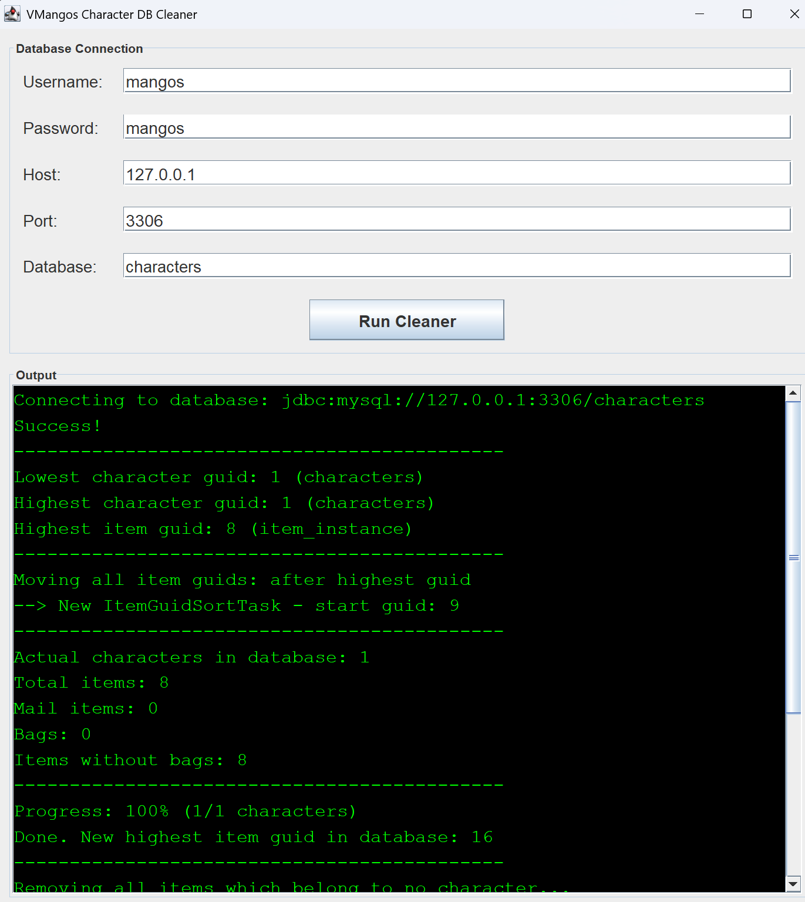

# vmangos-character-db-cleaner

A small tool to compact and re-order the item GUIDs in a VMangos character
database, and to clear out stale per-session data.

## What it does

Over the lifetime of a server, the `item_instance` table accumulates GUIDs that
grow without bound and become full of gaps — every deleted character, bot, or
removed item leaves a hole. This tool:

- **Re-orders all item GUIDs** sequentially per character (bags first, then
  regular items, then mail items), starting again from `1`.
- **Removes orphaned items** that no longer belong to any character (e.g. left
  over from deleted characters or bots).
- **Clears stale session data** so the next world start begins from a clean state.

The whole operation runs inside a **single transaction**: if anything fails, all
changes are rolled back and the database is left untouched.

### Tables whose item GUIDs are re-ordered
```
item_instance
character_inventory
mail_items
auction
character_gifts
```

### Tables cleared on every run
```
creature_respawn
gameobject_respawn
character_spell_cooldown
pet_spell_cooldown
```

## Requirements

- **JDK 8 or newer** (`javac` / `java` on your `PATH`).
- A MySQL server hosting the VMangos **characters** database.
  Tested against MySQL 5.x; the bundled `lib/mysql-connector-java-5.1.49.jar`
  is used as the JDBC driver — no separate download needed.

## ⚠️ Before you run

- **Stop the VMangos world server first.** This tool rewrites item GUIDs across
  several tables. Running it against a live database while the world server is
  online will corrupt your data.
- **Back up your character database** before continuing. Although the tool runs
  in a transaction, a backup is your safety net if something goes wrong.

## How to run

The tool opens a small GUI window where you enter the database connection
details and start the process — there are no command-line arguments.

### Option 1: Build scripts (Linux / macOS)
```bash
./build.sh   # compiles and packages vmangos-character-db-cleaner.jar
./run.sh     # builds first if needed, then launches the GUI
```

### Option 2: Windows / manual build

There are no Windows build scripts, so compile and run by hand (run from the
project root, requires a JDK on your `PATH`):

```powershell
javac -cp "lib/mysql-connector-java-5.1.49.jar" -d build (Get-ChildItem -Recurse src -Filter *.java).FullName
java  -cp "build;lib/mysql-connector-java-5.1.49.jar" Main
```

> Note: the classpath separator is `;` on Windows and `:` on Linux/macOS.

### Option 3: IDE (IntelliJ / Eclipse)

1. Add the JDBC driver to the project.
   Example for IntelliJ IDEA:
   - *File → Project Structure… → Modules → Dependencies tab*
   - press **[+] → Add JARs or Directories** and select
     `lib/mysql-connector-java-5.1.49.jar`
   - apply.
2. Run `src/Main.java`.

### Entering connection details

When the GUI opens, fill in the database connection fields:

- **Username:** Database user (default: `mangos`)
- **Password:** Database password (default: `mangos`)
- **Host:** Database host (default: `127.0.0.1`)
- **Port:** Database port (default: `3306`)
- **Database:** Database name (default: `characters`)

Press the **Run Cleaner** button to start the process. Progress is shown in the
output panel.

## Example result

After a run, all GUIDs in `item_instance` are ordered sequentially, and any
items that could not be linked to a character (deleted character, bot, …) have
been removed.

**Before run:**
- character with guid 1 has items with guids 2, 50, 767, 800
- character with guid 2 has items with guids 5, 23, 77, 9000

**After run:**
- character with guid 1 has items with guids 1, 2, 3, 4
- character with guid 2 has items with guids 5, 6, 7, 8


